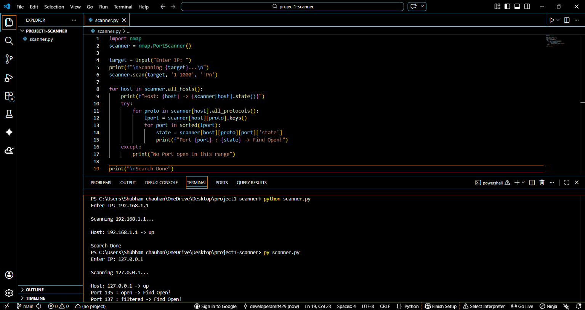

 # Project 1 - Port Scanner in Python
Built with Python + Nmap

### What it does:
- Scans 1-1000 ports on any IP
- Detects open ports
- Tested on 127.0.0.1 and 192.168.1.1

### Result Screenshot:

)

### How to run:
py scanner.py
